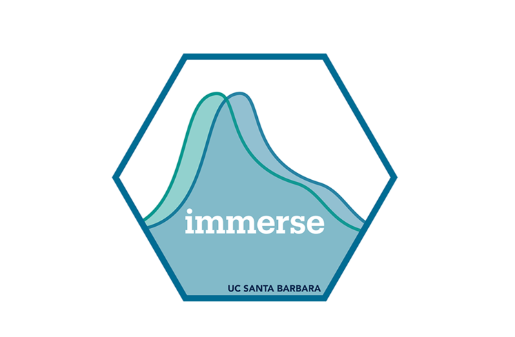

<h1>IMMERSE Continued Training</h1>

------------------------------------------------------------------------

 

------------------------------------------------------------------------

The Institute of Mixture Modeling for Equity-Oriented Researchers, Scholars, and Educators (IMMERSE) is an IES funded training grant (R305B220021) to support education scholars in integrating mixture modeling into their research.

------------------------------------------------------------------------

### Friday, August 23 , 2024

-   Speaker/Topic: [Sara Suzuki](https://circle.tufts.edu/index.php/people/sara-suzuki)/QuantCrit with Mixtures

-   Materials:
    -   [Slides](https://ucsb.box.com/s/ccv77x2kzpe5wkonvl0nf21pxj2ahucx)
    -   [Article_1](https://drive.google.com/file/d/1ONDqCIM8Xf_33eN5zfIShMFcTp-dSZ5p/view)
    -   [Article_2](https://www.sciencedirect.com/science/article/pii/S2666497623000528)
    -   [Video Recording]()

### Friday, September 6, 2024

-   Speaker/Topic: Dina and Karen/Joint Occurrence 

-   Materials:
    -   [Slides]()
    -   [Github Repository]()
    -   [Video Recording]()

### Friday, September 20, 2024

-   Speaker/Topic: Danielle Harlow/Qualitative and Mixtures (Tentative)

-   Materials:
    -   [Slides]()
    -   [Github Repository]()
    -   [Video Recording]()

### Friday, October 4, 2024

-   Speaker/Topic: Katherine/ LPA (Tentative)

-   Materials:
    -   [Slides]()
    -   [Github Repository]()
    -   [Video Recording]()

### Friday, October 18, 2024

-   Speaker/Topic: Amy Bellmore/Publishing Mixtures (Tentative)

-   Materials:
    -   [Slides]()
    -   [Github Repository]()
    -   [Video Recording]()

### Friday, November 1, 2024

-   Speaker/Topic: Karen/Latent Transition Analysis (Tentative)

-   Materials:
    -   [Slides]()
    -   [Github Repository]()
    -   [Video Recording]()

### Friday, November 15, 2024

-   Speaker/Topic: Ryan Grimm/Applications of LTA in interventions (Tentative)

-   Materials:
    -   [Slides]()
    -   [Github Repository]()
    -   [Video Recording]()
   

### Friday, November 29, 2024

-   Speaker/Topic: Katherine/Multilevel Mixture Models or Second Order (Tentative)

-   Materials:
    -   [Slides]()
    -   [Github Repository]()
    -   [Video Recording]()
      
### Friday, December 6, 2024

-   Speaker/Topic: Rebeca Rios/Latent Class Growth Analysis (Tentative)

-   Materials:
    -   [Slides]()
    -   [Github Repository]()
    -   [Video Recording]()

------------------------------------------------------------------------

Helpful Links:

-   Please [visit our website](https://immerse.education.ucsb.edu/) to learn more.

-   Visit our [GitHub](https://github.com/immerse-ucsb) account to access all the IMMERSE materials.

-   Follow us on [Twitter](https://twitter.com/IMMERSE_UCSB)!

------------------------------------------------------------------------

